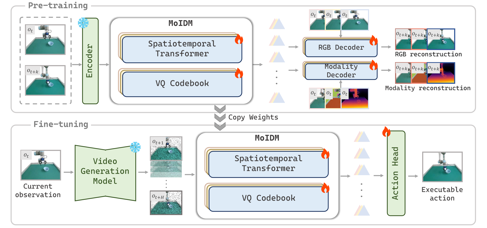

<div align="center">

# From Imagined Futures to Executable Actions:
# Mixture of Latent Actions for Robot Manipulation

### **ICML 2026**

[Project Page](https://logosroboticsgroup.github.io/MoLA) | [Paper](https://arxiv.org/abs/2605.12167) | [Checkpoints](https://huggingface.co/LeeLiaoLiao/MoLA-ckpt)

Yajie Li\*, Bozhou Zhang\*, Chun Gu, Zipei Ma, Jiahui Zhang, Jiankang Deng, Xiatian Zhu, Li Zhang

</div>

## Model Overview

<p align="center">
  
</p>

## Environment

Main MoLA environment:

```bash
conda create -n mola python==3.10
conda activate mola

pip install setuptools==57.5.0
git clone --recurse-submodules https://github.com/mees/calvin.git
cd calvin
sh install.sh

cd MoLA_PATH
pip install -r requirements.txt
pip install "numpy<2" --force-reinstall

pip uninstall -y torch torchvision torchaudio
pip install torch==2.1.0 torchvision==0.16.0 torchaudio==2.1.0 --index-url https://download.pytorch.org/whl/cu121
```

IDM training environment:

```bash
cd idms
conda create -n mola-idm python=3.8
conda activate mola-idm
pip install -r requirements.txt
cd ..
```

Benchmark environments:

```bash
git clone --recurse-submodules https://github.com/mees/calvin.git
cd calvin
sh install.sh
cd ..

git clone https://github.com/Lifelong-Robot-Learning/LIBERO.git
cd LIBERO
pip install -e .
cd ..
```

## Training

### Step 1: Video Imagination Model

MoLA first pre-encodes robot videos into SVD VAE latents, then fine-tunes the video imagination model on the cached latent videos.

#### Step 1.1: Prepare Latent Videos

**Download pre-extracted video-latent data.** Pre-extracted video-latent data can be downloaded from [Hugging Face: `yjguo/vpp_svd_latent`](https://huggingface.co/datasets/yjguo/vpp_svd_latent/tree/main).

**Prepare LIBERO video-latent data.** Download the official LIBERO hdf5 datasets from [Hugging Face: `yifengzhu-hf/LIBERO-datasets`](https://huggingface.co/datasets/yifengzhu-hf/LIBERO-datasets).

```bash
export LIBERO_SOURCE_DIR=/path/to/LIBERO-datasets
export LATENT_OUTPUT_DIR="$VIDEO_DATASET_DIR/libero"
export SVD_MODEL_PATH=stabilityai/stable-video-diffusion-img2vid

python step1_prepare_latent_libero.py
```

Set `train_args.dataset_dir` in `video_conf/*.yaml`, or use:

```bash
export VIDEO_DATASET_DIR=/path/to/opensource_robotdata
```

#### Step 1.2: Train the Video Model

Train the CALVIN video model:

```bash
accelerate launch --main_process_port 29506 step1_train_svd.py \
  --config video_conf/train_calvin_svd.yaml \
  train_args.clip_model_path=/path/to/clip-vit-base-patch32
```

Train the mixed CALVIN + LIBERO video model:

```bash
accelerate launch --main_process_port 29506 step1_train_svd.py \
  --config video_conf/train_calvin_libero_svd.yaml \
  train_args.clip_model_path=/path/to/clip-vit-base-patch32
```

Pretrained video model: the model finetuned on STH-v2, Open X-Embodiment, and CALVIN ABC videos is available at [Hugging Face: `yjguo/svd-robot-calvin-ft`](https://huggingface.co/yjguo/svd-robot-calvin-ft/tree/main).

### Step 2: Mixture of Inverse Dynamics Models

See [idms/README.md](idms/README.md) for details.

### Step 3: Action Model

CALVIN:

```bash
bash scripts/train_calvin_stage3.sh \
  /path/to/calvin/task_ABC_D \
  /path/to/video_model \
  openai/clip-vit-base-patch32 \
  8 \
  /path/to/idm_flow.pt \
  /path/to/idm_depth.pt \
  /path/to/idm_semantic.pt \
  false \
  32
```

LIBERO:

First train the action model on `libero_90`:

```bash
bash scripts/train_libero_stage3.sh \
  /path/to/libero_calvin_style/libero_90 \
  /path/to/video_model \
  openai/clip-vit-base-patch32 \
  8 \
  /path/to/idm_flow.pt \
  /path/to/idm_depth.pt \
  /path/to/idm_semantic.pt \
  false \
  32
```

Then train one separate model for each LIBERO suite:

```bash
for SUITE in libero_spatial libero_object libero_goal libero_10; do
  bash scripts/train_libero_stage3.sh \
    "/path/to/libero_calvin_style/${SUITE}" \
    /path/to/video_model \
    openai/clip-vit-base-patch32 \
    8 \
    /path/to/idm_flow.pt \
    /path/to/idm_depth.pt \
    /path/to/idm_semantic.pt \
    false \
    32
done
```

## Evaluation

CALVIN:

```bash
bash scripts/rollout_calvin.sh \
  /path/to/video_model \
  /path/to/action_model \
  /path/to/clip-vit-base-patch32 \
  "$CALVIN_DATASET_DIR" \
  8
```

LIBERO:

```bash
bash scripts/rollout_libero.sh \
  /path/to/action_model_dir \
  /path/to/video_model \
  /path/to/clip-vit-base-patch32 \
  /path/to/LIBERO \
  8 \
  [SUITE=libero_goal]
```

## Acknowledgements

- [Video Prediction Policy](https://github.com/roboterax/video-prediction-policy)
- [Moto](https://github.com/TencentARC/Moto)
- [DreamVLA](https://github.com/Zhangwenyao1/DreamVLA)

## Citation

```bibtex
@article{li2026imagined,
  title={From Imagined Futures to Executable Actions: Mixture of Latent Actions for Robot Manipulation},
  author={Li, Yajie and Zhang, Bozhou and Gu, Chun and Ma, Zipei and Zhang, Jiahui and Deng, Jiankang and Zhu, Xiatian and Zhang, Li},
  journal={arXiv preprint arXiv:2605.12167},
  year={2026}
}
```
